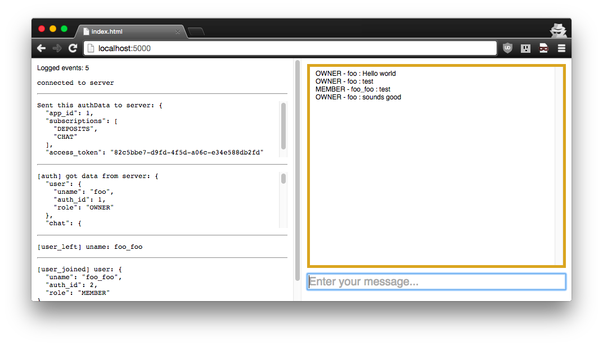

# socketpot-client

A minimal jQuery reference client that can talk to socketpot.

Intended to demonstrate how to interact with socketpot and to help
developers get started integrating their app with the socketpot server.

## Usage

- Open index.html to be logged in as user_id=1 ('foo') as auth_id=1 for
app_id=1. You will be the owner of this app.
- Add `#member` to the URL to be logged in as auth_id=2 ('foo_foo') for this
app. This user is a member.
